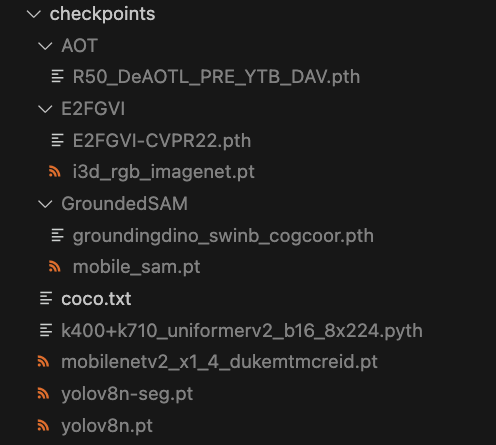

# ToolChainVideo


## Setup and Configuration 🛠️

1. Clone the repository 📦:
   ```python
   git clone git@github.com:fansunqi/ToolChainVideo.git
   cd ToolChainVideo
   ```
2. Create a virtual environment 🧹 and install the dependencies 🧑‍🍳:
   ```python
   conda create -n tcv python=3.9
   conda activate tcv
   pip install -r requirements.txt
   
   # install spatial_correlation_sampler from source code:
   git clone git@github.com:ClementPinard/Pytorch-Correlation-extension.git
   cd Pytorch-Correlation-extension
   python setup.py install
   cd ..
   ```
   Install Segment Anything and Grounding DINO in Grounded-Segment-Anything as in https://github.com/IDEA-Research/Grounded-Segment-Anything:
   ```python
   cd project/Grounded-Segment-Anything
   python -m pip install -e segment_anything
   pip install --no-build-isolation -e GroundingDINO
   cd ../..
   ```

3. Set up your API key 🗝️:
   - Fill in config/inference/inference.yaml with your keys:
     ```python
     openai:
       GPT_API_KEY: ["put your openai key here", ...]
     ```

5. Download the checkpoints  and bulid related project🧩:

   Thanks for the authors of these open source projects below for providing valuable pre-training models with outstanding performance🤝. When utilizing these models, users must strictly adhere to the authors' licensing agreements and properly cite the sources in published works.
   ```
   cd checkpoints
   ```

   - **download the pretrained model for yolo-tracking**
     ```python
     # download the pretrained model for object detection and tracking
     wget https://github.com/ultralytics/assets/releases/download/v8.2.0/yolov8n-seg.pt
     # download yolov8n
     wget https://huggingface.co/Ultralytics/YOLOv8/blob/main/yolov8n.pt
     # download mobilenetv2_x1_4_dukemtmcreid.pt
     wget https://drive.google.com/uc?id=12uD5FeVqLg9-AFDju2L7SQxjmPb4zpBN
     ```
     Rename the mobilenet checkpoint to mobilenetv2_x1_4_dukemtmcreid.pt
     Obtain the uniformerv2 checkpoint k400+k710_uniformerv2_b16_8x224.pyth from https://huggingface.co/Andy1621/uniformerv2/tree/main and place it under ```checkpoints/```. Rename it as ```k400+k710_uniformerv2_b16_8x224.pyth```
   - **download the pretrained model for dense captioning**
   
      The code will automatically download BLIP model from huggingface (https://huggingface.co/Salesforce/blip-image-captioning-large/tree/main). You can also download mannully.
   
   - **download the pretrained model for inpainting**
     ```python
     #download the pretrained model for inpainting
     mkdir ./E2FGVI
     cd ./E2FGVI
     # dowlond the chekpoints from below 
     [[Google Drive](https://drive.google.com/file/d/1tNJMTJ2gmWdIXJoHVi5-H504uImUiJW9/view?usp=sharing)] 
     [[Baidu Disk](https://pan.baidu.com/s/1qXAErbilY_n_Fh9KB8UF7w?pwd=lsjw)]
     cd ..
     ```

   - **download the pretrained model for rvos**
     ```python
     #download the pretrained model for rvos
     mkdir AOT 
     cd ./AOT
     # dowlond the chekpoints from below 
     [[Google Drive](https://drive.google.com/file/d/1QoChMkTVxdYZ_eBlZhK2acq9KMQZccPJ/view)]
     cd ..
     
     mkdir GroundedSAM
     cd ./GroundedSAM
     wget https://github.com/IDEA-Research/GroundingDINO/releases/download/v0.1.0-alpha2/groundingdino_swinb_cogcoor.pth
     wget https://github.com/ChaoningZhang/MobileSAM/blob/master/weights/mobile_sam.pt
     cd ../..
     ```
    The overall checkpoints file structure is as follows:



## Overview 📜

Thanks to the authors of these open-source projects for providing excellent projects.

#### Memory Construction

- **Time-dominant Memory** ⏱️
  - **Captioning**
    - BLIP/ BLIP2/ InstructBLIP
      - [https://huggingface.co/Salesforce/blip-image-captioning-large](https://huggingface.co/Salesforce/blip-image-captioning-large "https://huggingface.co/Salesforce/blip-image-captioning-large")
      - [https://huggingface.co/Salesforce/blip2-opt-2.7b](https://huggingface.co/Salesforce/blip2-opt-2.7b "https://huggingface.co/Salesforce/blip2-opt-2.7b")
      - [https://huggingface.co/docs/transformers/model\_doc/instructblip](https://huggingface.co/docs/transformers/model_doc/instructblip "https://huggingface.co/docs/transformers/model_doc/instructblip")
- **Space-dominant Memory** 🌐
  - **Category & Trajectory & Segmentation**
    - BOXMOT(yolo-tracking)+yolov8-seg
      - [mikel-brostrom/yolo\_tracking: A collection of SOTA real-time, multi-object tracking algorithms for object detectors (github.com)](https://github.com/mikel-brostrom/yolo_tracking "mikel-brostrom/yolo_tracking: A collection of SOTA real-time, multi-object tracking algorithms for object detectors (github.com)")
    - GroundedSAM+Deaot
      - [https://github.com/IDEA-Research/Grounded-Segment-Anything](https://github.com/IDEA-Research/Grounded-Segment-Anything "https://github.com/IDEA-Research/Grounded-Segment-Anything")
      - [https://github.com/yoxu515/aot-benchmark](https://github.com/yoxu515/aot-benchmark "https://github.com/yoxu515/aot-benchmark")
  - **Appearance**
    - BLIP/ BLIP2/ InstructBLIP
      - [https://huggingface.co/Salesforce/blip-image-captioning-large](https://huggingface.co/Salesforce/blip-image-captioning-large "https://huggingface.co/Salesforce/blip-image-captioning-large")
      - [https://huggingface.co/Salesforce/blip2-opt-2.7b](https://huggingface.co/Salesforce/blip2-opt-2.7b "https://huggingface.co/Salesforce/blip2-opt-2.7b")
      - [https://huggingface.co/docs/transformers/model\_doc/instructblip](https://huggingface.co/docs/transformers/model_doc/instructblip "https://huggingface.co/docs/transformers/model_doc/instructblip")
  - **Action Recognition**
    - InternVideo
      - [https://github.com/OpenGVLab/InternVideo](https://github.com/OpenGVLab/InternVideo "https://github.com/OpenGVLab/InternVideo")

#### Other Tools

- **GoogleSearch** (TODO)
  - langchain - google
    - &#x20;[Google Search | 🦜️🔗 Langchain](https://python.langchain.com/docs/integrations/tools/google_search "Google Search | 🦜️🔗 Langchain")
- **VideoInpainting** (TODO)
  - E2FGVI &#x20;
    - [MCG-NKU/E2FGVI: Official code for "Towards An End-to-End Framework for Flow-Guided Video Inpainting" (CVPR2022) (github.com)](https://github.com/MCG-NKU/E2FGVI "MCG-NKU/E2FGVI: Official code for \"Towards An End-to-End Framework for Flow-Guided Video Inpainting\" (CVPR2022) (github.com)")

## NExT-QA 试验

下载 NeXT-QA 数据：
```
git clone git@github.com:doc-doc/NExT-QA.git
```
specify your data path in ```config/nextqa.yaml```

运行指令：

```
python ./scripts/main.py
```

默认使用的 config 是 `config/nextqa.yaml`

评测指令：

```
python eval/eval_nextqa.py
```

